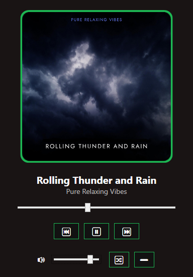

# SpotControl

## Overview
SpotControl is a modern WPF desktop application for controlling Spotify playback on your account. It demonstrates C# and WPF concepts, including:
- **OAuth authentication** with Spotify
- **MVVM (Model-View-ViewModel)** architecture for clean separation of UI and logic
- **Multithreading** for responsive UI and background updates
- **Exception handling** for robust user experience
- **Inheritance and class design** for extensibility
- **Data binding** for dynamic UI updates

## Getting Started

> Requires .NET 6.0 or later, Spotify Premium, and a [Spotify Developer app](https://developer.spotify.com/).

1. **Clone the repository**
2. **Open in Visual Studio 2022+**
3. **Restore NuGet packages**
4. **Run the application**
5. **Login to Spotify** when prompted

> Or download the latest release from the [Releases](https://www.github.com/PhantomOffKanagawa/SpotControl/releases) page.

## Features

### Low-bar (Minimum)
- **Authenticate with Spotify** using OAuth
- **Display currently playing track info** (title, artist)
- **Basic playback control** Play, Pause, Next, Previous
- **Responsive WPF interface**

### Target (Expected)
- **Volume control slider**
- **Track progress bar** with seek functionality
- **Shuffle and repeat toggle**
- **Dynamic UI updates** using MVVM and data binding
- **Exception handling** for network/API issues

### High-bar (Stretch Goal)
- **Playback art** (album cover)
- ~~**Search** for songs/playlists and play them~~
- ~~**Display playlists** and allow selection~~
- ~~**Keyboard Hotkey** media key integration~~
- ~~**System tray minimization** with pop-up notifications~~
- ~~**Theme switching** (light/dark mode)~~

## Architecture & Concepts

### Model-View-ViewModel (MVVM)
- **Model**: Spotify API data (track, playback state)
- **View**: WPF XAML files (`MainWindow.xaml`, `LoginWindow.xaml`)
- **ViewModel**: `PlayerViewModel` mediates between Spotify data and the UI, exposing properties and commands for binding.

### Classes & Inheritance
- `MediaController` (abstract base class) defines playback control methods.
- `SpotifyService` inherits from `MediaController` and implements Spotify-specific logic.
- `BaseViewModel` (abstract base class) provides common functionality for all ViewModels, including property change notifications.
- `MediaViewModel` (abstract class) inherits from `BaseViewModel` and defines properties and commands for media control.
- `PlayerViewModel` inherits from `MediaViewModel` and implements Spotify-specific logic.

### Methods
- Each user action (play, pause, next, previous, seek, set volume, toggle shuffle/repeat) is encapsulated in a method, often exposed as an `ICommand` for WPF binding.
- Methods like `UpdateTrackInfoAsync` fetch and update UI data.

### Loops
- Background polling for track info and progress uses `while` loops in async tasks to periodically update the UI.

### Strings, Arrays, and Lists
- Track and artist names are handled as strings.
- Artist lists are joined into a single string for display.

### Multithreading
- Uses `Task.Run` and `async/await` for background polling and API calls, keeping the UI responsive.
- Cancellation tokens allow safe stopping of background threads.

### Exception Handling
- All network and API calls are wrapped in try/catch blocks to handle errors gracefully and inform the user.

## Screenshots

---

## Acknowledgements
- [SpotifyAPI-NET](https://github.com/JohnnyCrazy/SpotifyAPI-NET)
- [MVVM Light Toolkit](https://github.com/lbugnion/mvvmlight)